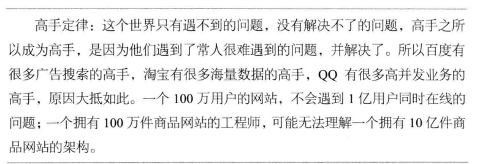
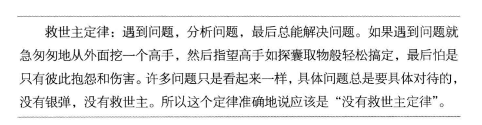

# 大型网站技术架构经验归纳
+ 大型网站不是设计出来的而是逐步发展演进出来的，而且一定是通过不断解决各种实际问题和实现各种需求而发展起来的。
+ 网站访问特点和现实世界的财富分配一样遵循二八定律：80%的业务访问集中在20%的数据上。
+ 研究表明：网站访问延迟和用户流失率成正相关，网站访问越慢，用户越容易失去耐心而离开。
+ 网站的价值在于它能为用户提供什么价值，在于网站能做什么，而不在于它是怎么做的。
+ 驱动大型网站技术发展的主要力量是网站的业务发展。是业务成就了技术。
+ 具体问题具体分析，技术存在的价值一定是为了解决某些实际存在的问题的，需要根据具体业务灵活应对。
+ 技术只是解决问题的方式方法，要解决的业务问题才是核心。
+ 架构：最高层次的规划，难以改变的决定。
+ 软件架构；有关软件整体结构与组件的抽象描述，用于指导大型软件系统各方面的设计。
+ 网站性能优化第一定律：优先考虑使用缓存优化性能。
+ 不允许没有监控的系统上线
+ 计算机的任何问题都可以通过添加一个虚拟层来解决
+ 高手定律
---

+ 没有救世主定律
---
