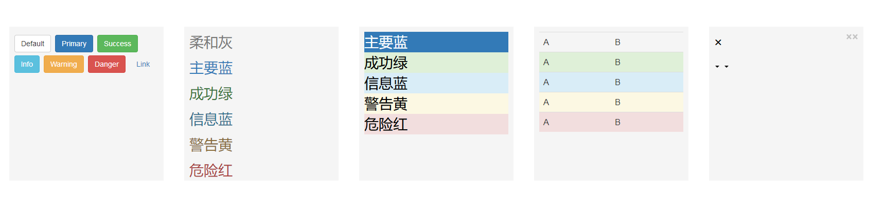
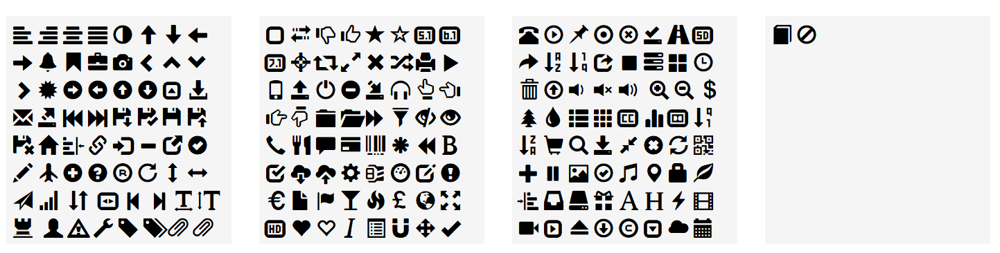
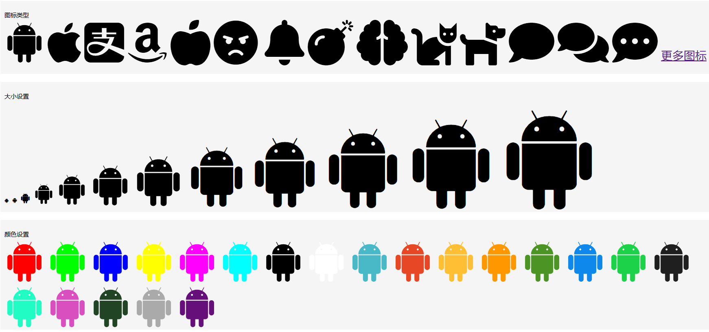

# 深入理解BootStrap
+ BootStrap整体架构图

+ 响应式设计
  + 弹性网格(栅格系统)、布局和图片
  + CSS媒体查询
  + meta 元标签
    ```html
    <meta 
          name="viewport" 
          content="width=device-width,
          initial-scale=1.0, 
          maximum-scale=1.0, 
          minimum-scale=1.0, 
          user-scalable=no"
    />
    ```
+ BootStrap核心
  + CSS布局
  ```html
  <head>
	  <link rel="stylesheet" 
		href="https://cdn.staticfile.org/twitter-bootstrap/3.3.7/css/bootstrap.min.css">
	  <script src="https://cdn.staticfile.org/jquery/2.1.1/jquery.min.js"></script>
	  <script src="https://cdn.staticfile.org/twitter-bootstrap/3.3.7/js/bootstrap.min.js"></script>
  </head>
	<style>
		.sizePosition
		{
			width:300px;
			height:300px;
			margin:100px 10px 0 30px;
			padding:10px;
			float:left;
			display:block;
			background-color:#f5f5f5;
			color:#000;
			font-size:28px
		}
		.caret-self{ /*向下箭头*/
			display: inline-block;
			width: 0; 
			height: 0;
			margin-left: 2px;
			vertical-align: middle;
			border-top: 4px solid;
			border-right: 4px solid transparent;
			border-left: 4px solid transparent;
		}
	</style>
	<body>
		<div class="sizePosition"><!-- 按钮色 -->
			<button type="button" class="btn btn-default">Default</button>
			<button type="button" class="btn btn-primary">Primary</button>
			<button type="button" class="btn btn-success">Success</button>
			<button type="button" class="btn btn-info">Info</button>
			<button type="button" class="btn btn-warning">Warning</button>
			<button type="button" class="btn btn-danger">Danger</button>
			<button type="button" class="btn btn-link">Link</button>
		</div>
		<div class="sizePosition"><!-- 字体色 -->
			<p class="text-muted">柔和灰</p>
			<p class="text-primary">主要蓝</p>
			<p class="text-success">成功绿</p>
			<p class="text-info">信息蓝</p>
			<p class="text-warning">警告黄</p>
			<p class="text-danger">危险红</p>
		</div>
		<div class="sizePosition"><!-- 背景色 -->
			<div class="bg-primary">主要蓝</div>
			<div class="bg-success">成功绿</div>
			<div class="bg-info">信息蓝</div>
			<div class="bg-warning">警告黄</div>
			<div class="bg-danger">危险红</div>
		</div>
		<div class="sizePosition"><!-- 表格行级元素样式 -->
			<table class="table table-hover"><!-- 鼠标悬停效果 -->
				<tr class="active">
					<td>A<td>
					<td>B<td>
				</tr>
				<tr class="success">
					<td>A<td>
					<td>B<td>
				</tr>
				<tr class="Info">
					<td>A<td>
					<td>B<td>
				</tr>
				<tr class="warning">
					<td>A<td>
					<td>B<td>
				</tr>
				<tr class="danger">
					<td>A<td>
					<td>B<td>
				</tr>
			</table>
		</div>
		<div class="sizePosition"><!-- 辅助图标 -->
			<button type="button" class="close">&times;</button>
			<a class="close">&times;</a>
			<p>&times;</p>
			<p class="caret"></p>
			<p class="caret-self"></p>
		</div>
	</body>
  ```
  ---
  
  + CSS组件
  	+ 图标
	```html
	<head>
	<link 
	  rel="stylesheet" 
	      href="https://cdn.staticfile.org/twitter-bootstrap/3.3.7/css/bootstrap.min.css">
	  <script 
             src="https://cdn.staticfile.org/jquery/2.1.1/jquery.min.js"></script>
	  <script 
	     src="https://cdn.staticfile.org/twitter-bootstrap/3.3.7/js/bootstrap.min.js"></script>
	</head>
	<style>
		.sizePosition
		{
			width:325px;
			height:330px;
			margin:100px 10px 0 30px;
			padding:10px;
			float:left;
			display:block;
			background-color:#f5f5f5;
			color:#000;
			font-size:28px
		}
	</style>
	<body>
		<div class="sizePosition"><!-- 小图标 -->
			<!-- <i class="glyphicon glyphicon-align-left"></i> -->
        	<span class="glyphicon glyphicon-align-left"></span>
        	<i class="glyphicon glyphicon-align-right"></i>
        	<i class="glyphicon glyphicon-align-center"></i>
        	<i class="glyphicon glyphicon-align-justify"></i>
        	<i class="glyphicon glyphicon-adjust"></i>
        	<i class="glyphicon glyphicon-arrow-up"></i>
        	<i class="glyphicon glyphicon-arrow-down"></i>
        	<i class="glyphicon glyphicon-arrow-left"></i>
			<i class="glyphicon glyphicon-arrow-right"></i>
        	<i class="glyphicon glyphicon-bell"></i>
        	<i class="glyphicon glyphicon-bookmark"></i>
        	<i class="glyphicon glyphicon-briefcase"></i>
        	<i class="glyphicon glyphicon-camera"></i>
        	<i class="glyphicon glyphicon-chevron-left"></i>
        	<i class="glyphicon glyphicon-chevron-up"></i>
        	<i class="glyphicon glyphicon-chevron-down"></i>
        	<i class="glyphicon glyphicon-chevron-right"></i>
        	<i class="glyphicon glyphicon-certificate"></i>
        	<i class="glyphicon glyphicon-circle-arrow-right"></i>
        	<i class="glyphicon glyphicon-circle-arrow-left"></i>
        	<i class="glyphicon glyphicon-circle-arrow-up"></i>
			<i class="glyphicon glyphicon-circle-arrow-down"></i>
        	<i class="glyphicon glyphicon-collapse-up"></i>
        	<i class="glyphicon glyphicon-download-alt"></i>
        	<i class="glyphicon glyphicon-envelope"></i>
        	<i class="glyphicon glyphicon-export"></i>
        	<i class="glyphicon glyphicon-fast-backward"></i>
        	<i class="glyphicon glyphicon-fast-forward"></i>
        	<i class="glyphicon glyphicon-floppy-save"></i>
        	<i class="glyphicon glyphicon-floppy-saved"></i>
        	<i class="glyphicon glyphicon-floppy-disk"></i>
        	<i class="glyphicon glyphicon-floppy-open"></i>
        	<i class="glyphicon glyphicon-floppy-remove"></i>
        	<i class="glyphicon glyphicon-home"></i>
        	<i class="glyphicon glyphicon-indent-right"></i>
        	<i class="glyphicon glyphicon-link"></i>
        	<i class="glyphicon glyphicon-log-in"></i>
        	<i class="glyphicon glyphicon-minus"></i>
        	<i class="glyphicon glyphicon-new-window"></i>
        	<i class="glyphicon glyphicon-ok-sign"></i>
        	<i class="glyphicon glyphicon-pencil"></i>
        	<i class="glyphicon glyphicon-plane"></i>
        	<i class="glyphicon glyphicon-plus-sign"></i>
        	<i class="glyphicon glyphicon-question-sign"></i>
        	<i class="glyphicon glyphicon-registration-mark"></i>
        	<i class="glyphicon glyphicon-repeat"></i>
        	<i class="glyphicon glyphicon-resize-vertical"></i>
        	<i class="glyphicon glyphicon-resize-horizontal"></i>
        	<i class="glyphicon glyphicon-send"></i>
        	<i class="glyphicon glyphicon-signal"></i>
        	<i class="glyphicon glyphicon-sort-by-attributeds"></i>
        	<i class="glyphicon glyphicon-sort"></i>
			<i class="glyphicon glyphicon-sort-by-attributeds-alt"></i>
        	<i class="glyphicon glyphicon-sound-stereo"></i>
        	<i class="glyphicon glyphicon-step-backward"></i>
        	<i class="glyphicon glyphicon-step-forward"></i>
        	<i class="glyphicon glyphicon-text-width"></i>
        	<i class="glyphicon glyphicon-text-height"></i>
        	<i class="glyphicon glyphicon-tower"></i>
        	<i class="glyphicon glyphicon-three-deciduous"></i>
        	<i class="glyphicon glyphicon-user"></i>
        	<i class="glyphicon glyphicon-warning-sign"></i>
        	<i class="glyphicon glyphicon-wrench"></i>
        	<i class="glyphicon glyphicon-tag"></i>
        	<i class="glyphicon glyphicon-tags"></i>
        	<i class="glyphicon glyphicon-paperclip"></i>
        	<i class="glyphicon glyphicon-paperclip"></i>
		</div>
		<div class="sizePosition">
			<i class="glyphicon glyphicon-unchecked"></i>
			<i class="glyphicon glyphicon-transfer"></i>
			<i class="glyphicon glyphicon-thumbs-down"></i>
			<i class="glyphicon glyphicon-thumbs-up"></i>
			<i class="glyphicon glyphicon-star"></i>
			<i class="glyphicon glyphicon-star-empty"></i>
			<i class="glyphicon glyphicon-sound-5-1"></i>
        	<i class="glyphicon glyphicon-sound-6-1"></i>
        	<i class="glyphicon glyphicon-sound-7-1"></i>
			<i class="glyphicon glyphicon-screenshot"></i>
			<i class="glyphicon glyphicon-retweet"></i>
			<i class="glyphicon glyphicon-resize-full"></i>
			<i class="glyphicon glyphicon-remove"></i>
			<i class="glyphicon glyphicon-random"></i>
			<i class="glyphicon glyphicon-print"></i>
			<i class="glyphicon glyphicon-play"></i>
			<i class="glyphicon glyphicon-phone"></i>
			<i class="glyphicon glyphicon-open"></i>
			<i class="glyphicon glyphicon-off"></i>
			<i class="glyphicon glyphicon-minus-sign"></i>
			<i class="glyphicon glyphicon-import"></i>
			<i class="glyphicon glyphicon-headphones"></i>
			<i class="glyphicon glyphicon-hand-up"></i>
			<i class="glyphicon glyphicon-hand-left"></i>
			<i class="glyphicon glyphicon-hand-right"></i>
        	<i class="glyphicon glyphicon-hand-down"></i>
			<i class="glyphicon glyphicon-folder-close"></i>
			<i class="glyphicon glyphicon-folder-open"></i>
			<i class="glyphicon glyphicon-forward"></i>
			<i class="glyphicon glyphicon-filter"></i>
			<i class="glyphicon glyphicon-eye-close"></i>
			<i class="glyphicon glyphicon-eye-open"></i>
			<i class="glyphicon glyphicon-earphone"></i>
			<i class="glyphicon glyphicon-cutlery"></i>
			<i class="glyphicon glyphicon-comment"></i>
			<i class="glyphicon glyphicon-credit-card"></i>
			<i class="glyphicon glyphicon-barcode"></i>
        	<i class="glyphicon glyphicon-asterisk"></i>
			<i class="glyphicon glyphicon-backward"></i>
			<i class="glyphicon glyphicon-bold"></i>
			<i class="glyphicon glyphicon-bullhom"></i>
			<i class="glyphicon glyphicon-check"></i>
			<i class="glyphicon glyphicon-cloud-download"></i>
        	<i class="glyphicon glyphicon-cloud-upload"></i>
			<i class="glyphicon glyphicon-cog"></i>
			<i class="glyphicon glyphicon-compressed"></i>
			<i class="glyphicon glyphicon-dashboard"></i>
			<i class="glyphicon glyphicon-edit"></i>
			<i class="glyphicon glyphicon-exclamation-sign"></i>
		    <i class="glyphicon glyphicon-euro"></i>
			<i class="glyphicon glyphicon-file"></i>
			<i class="glyphicon glyphicon-flag"></i>
		    <i class="glyphicon glyphicon-glass"></i>
			<i class="glyphicon glyphicon-fire"></i>
			<i class="glyphicon glyphicon-gbp"></i>
			<i class="glyphicon glyphicon-globe"></i>
			<i class="glyphicon glyphicon-fullscreen"></i>
			<i class="glyphicon glyphicon-hd-video"></i>
			<i class="glyphicon glyphicon-heart"></i>
			<i class="glyphicon glyphicon-heart-empty"></i>
			<i class="glyphicon glyphicon-italic"></i>
			<i class="glyphicon glyphicon-list-alt"></i>
			<i class="glyphicon glyphicon-magnet"></i>
			<i class="glyphicon glyphicon-move"></i>
			<i class="glyphicon glyphicon-ok"></i>
		</div>
		<div class="sizePosition">
			<i class="glyphicon glyphicon-phone-alt"></i>
			<i class="glyphicon glyphicon-play-circle"></i>
			<i class="glyphicon glyphicon-pushpin"></i>
			<i class="glyphicon glyphicon-record"></i>
			<i class="glyphicon glyphicon-remove-circle"></i>
		    <i class="glyphicon glyphicon-saved"></i>
			<i class="glyphicon glyphicon-road"></i>
			<i class="glyphicon glyphicon-sd-video"></i>
			<i class="glyphicon glyphicon-share-alt"></i>
			<i class="glyphicon glyphicon-sort-by-alphabet"></i>
			<i class="glyphicon glyphicon-sort-by-order"></i>
			<i class="glyphicon glyphicon-share"></i>
			<i class="glyphicon glyphicon-stop"></i>
			<i class="glyphicon glyphicon-tasks"></i>
			<i class="glyphicon glyphicon-th-large"></i>
			<i class="glyphicon glyphicon-time"></i>
			<i class="glyphicon glyphicon-trash"></i>
			<i class="glyphicon glyphicon-upload"></i>
			<i class="glyphicon glyphicon-volume-down"></i>
			<i class="glyphicon glyphicon-volume-off"></i>
			<i class="glyphicon glyphicon-volume-up"></i>
			<i class="glyphicon glyphicon-volume-"></i>
			<i class="glyphicon glyphicon-zoom-in"></i>
			<i class="glyphicon glyphicon-zoom-out"></i>
			<i class="glyphicon glyphicon-usd"></i>
			<i class="glyphicon glyphicon-tree-conifer"></i>
			<i class="glyphicon glyphicon-tint"></i>
			<i class="glyphicon glyphicon-th-list"></i>
            <i class="glyphicon glyphicon-th"></i>
			<i class="glyphicon glyphicon-subtitles"></i>
			<i class="glyphicon glyphicon-stats"></i>
			<i class="glyphicon glyphicon-sound-dolby"></i>
			<i class="glyphicon glyphicon-sort-by-order-alt"></i>
			<i class="glyphicon glyphicon-sort-by-alphabet-alt"></i>
			<i class="glyphicon glyphicon-shopping-cart"></i>
			<i class="glyphicon glyphicon-search"></i>
			<i class="glyphicon glyphicon-save"></i>
			<i class="glyphicon glyphicon-resize-small"></i>
			<i class="glyphicon glyphicon-remove-sign"></i>
			<i class="glyphicon glyphicon-refresh"></i>
			<i class="glyphicon glyphicon-qrcode"></i>
			<i class="glyphicon glyphicon-plus"></i>
			<i class="glyphicon glyphicon-pause"></i>
			<i class="glyphicon glyphicon-picture"></i>
			<i class="glyphicon glyphicon-ok-circle"></i>
			<i class="glyphicon glyphicon-music"></i>
			<i class="glyphicon glyphicon-map-marker"></i>
			<i class="glyphicon glyphicon-lock"></i>
			<i class="glyphicon glyphicon-leaf"></i>
			<i class="glyphicon glyphicon-indent-left"></i>
			<i class="glyphicon glyphicon-inbox"></i>
			<i class="glyphicon glyphicon-hdd"></i>
			<i class="glyphicon glyphicon-gift"></i>
			<i class="glyphicon glyphicon-font"></i>
			<i class="glyphicon glyphicon-header"></i>
			<i class="glyphicon glyphicon-flash"></i>
			<i class="glyphicon glyphicon-film"></i>
			<i class="glyphicon glyphicon-facetime-video"></i>
			<i class="glyphicon glyphicon-expand"></i>
			<i class="glyphicon glyphicon-eject"></i>
			<i class="glyphicon glyphicon-download"></i>
			<i class="glyphicon glyphicon-copyright-mark"></i>
			<i class="glyphicon glyphicon-collapse-down"></i>
			<i class="glyphicon glyphicon-cloud"></i>
			<i class="glyphicon glyphicon-calendar"></i>
		</div>
		<div class="sizePosition">
			<i class="glyphicon glyphicon-book"></i>
			<i class="glyphicon glyphicon-ban-circle"></i>
		</div>
	</body>
	```
	---
	
	+ awesome图标
	```html
		<head>
	  <link rel="stylesheet" 
	  href="https://use.fontawesome.com/releases/v5.6.1/css/all.css" 
	  integrity="sha384-gfdkjb5BdAXd+lj+gudLWI+BXq4IuLW5IT+brZEZsLFm++aCMlF1V92rMkPaX4PP" 
	  crossorigin="anonymous">
	</head>
	<style>
		.sizePosition
		{
			width:96%;
			height:250px;
			margin:10px 10px 10px 10px;
			padding:10px;
			float:left;
			display:block;
			background-color:#f5f5f5;
			color:#000;
			font-size:28px
		}
		.sizePosition>p{font-size:15px;position:relative;left:0;top:0;margin-bottom:0;}
	</style>
	<body><!-- font-awesome图标 -->
		<div class="sizePosition" style="height:160px;"><!-- 图标类型-->
			<p>图标类型</p>
			<i class="fab fa-android" style="font-size:4em;"></i>
			<i class="fab fa-apple" style="font-size:4em;"></i>
			<i class="fab fa-alipay" style="font-size:4em;"></i>
			<i class="fab fa-amazon" style="font-size:4em;"></i>
			<i class="fas fa-apple-alt" style="font-size:4em;"></i>
			<i class="fas fa-angry" style="font-size:4em;"></i>
			<i class="fas fa-acorn" style="font-size:4em;"></i>
			<i class="fas fa-bell" style="font-size:4em;"></i>
			<i class="fas fa-bomb" style="font-size:4em;"></i>
			<i class="fas fa-brain" style="font-size:4em;"></i>
			<i class="fas fa-cat" style="font-size:4em;"></i>
			<i class="fas fa-dog" style="font-size:4em;"></i>
			<i class="fas fa-comment" style="font-size:4em;"></i>
			<i class="fas fa-comments" style="font-size:4em;"></i>
			<i class="fas fa-comment-dots" style="font-size:4em;"></i>
			<a href="https://fontawesome.com/icons?d=gallery">更多图标</a>
		</div>
		<div class="sizePosition" style="height:300px;"><!-- 大小设置 -->
			<p>大小设置</p>
			<i class="fab fa-android" style="font-size:.1em;"></i>
			<i class="fab fa-android" style="font-size:.5em;"></i>
			<i class="fab fa-android" style="font-size:1em;"></i>
			<i class="fab fa-android" style="font-size:2em;"></i>
			<i class="fab fa-android" style="font-size:3em;"></i>
			<i class="fab fa-android" style="font-size:4em;"></i>
			<i class="fab fa-android" style="font-size:5em;"></i>
			<i class="fab fa-android" style="font-size:6em;"></i>
			<i class="fab fa-android" style="font-size:7em;"></i>
			<i class="fab fa-android" style="font-size:8em;"></i>
			<i class="fab fa-android" style="font-size:9em;"></i>
			<i class="fab fa-android" style="font-size:10em;"></i>
		</div>
		<div class="sizePosition"><!-- 颜色设置 -->
			<p>颜色设置</p>
			<i class="fab fa-android" style="font-size:4em;color:#f00;"></i>
			<i class="fab fa-android" style="font-size:4em;color:#0f0;"></i>
			<i class="fab fa-android" style="font-size:4em;color:#00f;"></i>
			<i class="fab fa-android" style="font-size:4em;color:#ff0;"></i>
			<i class="fab fa-android" style="font-size:4em;color:#f0f;"></i>
			<i class="fab fa-android" style="font-size:4em;color:#0ff;"></i>
			<i class="fab fa-android" style="font-size:4em;color:#000;"></i>
			<i class="fab fa-android" style="font-size:4em;color:#fff;"></i>
			<i class="fab fa-android" style="font-size:4em;color:#49b8c7;"></i>
			<i class="fab fa-android" style="font-size:4em;color:#e74724;"></i>
			<i class="fab fa-android" style="font-size:4em;color:#ffbf34;"></i>
			<i class="fab fa-android" style="font-size:4em;color:#ff9800;"></i>
			<i class="fab fa-android" style="font-size:4em;color:#4c9424;"></i>
			<i class="fab fa-android" style="font-size:4em;color:#0e88eb;"></i>
			<i class="fab fa-android" style="font-size:4em;color:#1cd248;"></i>
			<i class="fab fa-android" style="font-size:4em;color:#201f1f;"></i>
			<i class="fab fa-android" style="font-size:4em;color:#21fcc4;"></i>
			<i class="fab fa-android" style="font-size:4em;color:#d94fbf;"></i>
			<i class="fab fa-android" style="font-size:4em;color:#204424;"></i>
			<i class="fab fa-android" style="font-size:4em;color:#aaa;"></i>
			<i class="fab fa-android" style="font-size:4em;color:#660e7a;"></i>
		</div>
	</body>
	```
	---
	
