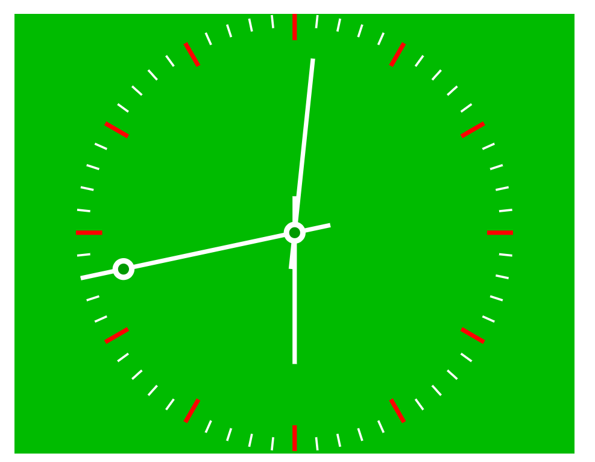

#  canvas实现时钟
```
  <!DOCTYPE html>
  <html>
      <head>
        <meta charset="UTF-8"/>
        <title>一个时钟</title>
      <style>
        html,body 
        {
          margin:0;
          width:100%;
          height:100%;
          text-align:center;
          font-family:方正姚体;
          color:#fff;
        }
        #wrapper 
        {
          width:50%;
          height:60%;
          display:table;
          background:#0b0;
          margin:50px;
        }
        #cell 
        {
          display:table-cell;
          vertical-align:middle;
        }
      </style>
      <script>
        function drawPointers() {
          var size = window.innerWidth <= window.innerHeight?window.innerWidth:window.innerHeight;
          var width = height = size*0.8;
          var dot = {x:width/2,y:height/2,radius:width/40}; // 原点位置和表心半径
          var radius = width/2; // 半径
          var lineWidth = radius/50;
          var clock = document.getElementById("clock");
          var clockCtx = clock.getContext("2d");
          clock.width = width;
          clock.height = height;
          clockCtx.translate(dot.x,dot.y);//确定原点
          // 绘制时钟刻度
          for (var i=0,angle=0,r,len;i<60;i++) {
            if (0 === i % 5) {
              clockCtx.lineWidth = lineWidth;//线条宽度
              len = lineWidth*6;
              clockCtx.strokeStyle = "#f00";
            } else {
              clockCtx.lineWidth = lineWidth/2;
              len = lineWidth*3;
              clockCtx.strokeStyle = "#fff";
            }
            clockCtx.beginPath();
            r = radius;
            clockCtx.moveTo(r*Math.cos(angle),r*Math.sin(angle));
            r -= len;
            clockCtx.lineTo(r*Math.cos(angle),r*Math.sin(angle));
            clockCtx.stroke();
            clockCtx.closePath();
            angle += Math.PI/30; // 每次递增π/30
          }
          var now = new Date();
          h = now.getHours();
          m = now.getMinutes();
          s = now.getSeconds();

          var hourLineColor = "#fff";
          var minuteLineColor = "#fff";
          var secondLineColor = "#fff";
          // 时针
          clockCtx.save();
          clockCtx.lineWidth = lineWidth;
          clockCtx.strokeStyle = hourLineColor
          clockCtx.rotate(h*Math.PI/6);
          clockCtx.beginPath();
          clockCtx.moveTo(0,-radius*0.6);
          clockCtx.lineTo(0,radius/6);
          clockCtx.stroke();
          clockCtx.closePath();
          clockCtx.restore();
          // 分针
          clockCtx.save();
          clockCtx.lineWidth = lineWidth;
          clockCtx.strokeStyle = minuteLineColor
          clockCtx.rotate(m*Math.PI/30);
          clockCtx.beginPath();
          clockCtx.moveTo(0,-radius*0.8);
          clockCtx.lineTo(0,radius/6);
          clockCtx.stroke();
          clockCtx.closePath();
          clockCtx.restore();
          // 秒针
          clockCtx.save();
          clockCtx.lineWidth = lineWidth;
          clockCtx.strokeStyle = secondLineColor
          clockCtx.rotate(s*Math.PI/30);
          clockCtx.beginPath();
          clockCtx.moveTo(0,-radius);
          clockCtx.lineTo(0,radius/6)
          clockCtx.stroke();
          clockCtx.closePath();

          clockCtx.beginPath();
          clockCtx.fillStyle = "#fff";
          clockCtx.arc(0,-radius*0.8,dot.radius,0,2*Math.PI);
          clockCtx.fill();
          clockCtx.closePath();

          clockCtx.beginPath();
          clockCtx.fillStyle = "#090";
          clockCtx.arc(0,-radius*0.8,dot.radius/2,0,2*Math.PI);
          clockCtx.fill();
          clockCtx.closePath();
          clockCtx.restore();
          
          clockCtx.save();

          //表心
          //外心
          clockCtx.beginPath();
          clockCtx.fillStyle = "#fff";
          clockCtx.arc(0,0,dot.radius,0,2*Math.PI);
          clockCtx.fill();
          clockCtx.closePath();
          //内心
          clockCtx.beginPath();
          clockCtx.fillStyle = "#090";
          clockCtx.arc(0,0,dot.radius/2,0,2*Math.PI);
          clockCtx.fill();
          clockCtx.closePath();
          clockCtx.restore();
        }
        setInterval(drawPointers,1000);//每1s重绘
      </script>
      </head>
      <body>
        <center>
          <div id="wrapper">
            <div id="cell">
              <canvas id="clock"></canvas>
            </div>
          </div>
        </center>
      </body>
  </html>
```
---

