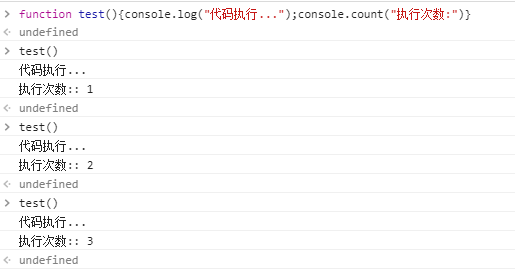
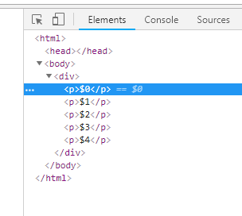

# console
+ 源码定位：在Console输入js方法名,点击出现的结果即可定位到方法的位置
+ 用于输出信息的方法
  + log:一般信息
  + info:提示信息
  + warn:警示信息
  + error:错误信息
  + dirxml:输出html文档中的某个节点
+ 格式化输出
  + %s     :字符串
  + %d(%i) :整数
  + %f     :浮点数
  + %c     :指定样式输出
  + %o     :对象展开
  + %O     :对象输出
---

---
+ 分组输出
  + console.group:分组开始
  + console.groupEnd:分组结束
---

---
+ 记录代码执行次数
  + console.count
---

---
+ 结构化输出
  + %O
  + %o
  + console.dir
---

---
+ 将对象以表格形式输出
  + console.table()
---

---
+ 计时:二者括号内的内容必须完全相同
  + console.time("内容必须相同"):计时开始
  + console.timeEnd("内容必须相同"):计时结束
---

---
+ keys&&valus
---

---
+ $符号
+ $_:返回上次表达式的结果
+ $0-$4:最近在'Elements'中选择的5个html元素
+ 
---

---
Elements下的html内容
---

---
+ 函数监视器
  + monitor(): 开始监视
  + unmonitor: 解除监视
---

---
+ 复制
  + copy($0):将$0对应的内容复制到剪贴板
