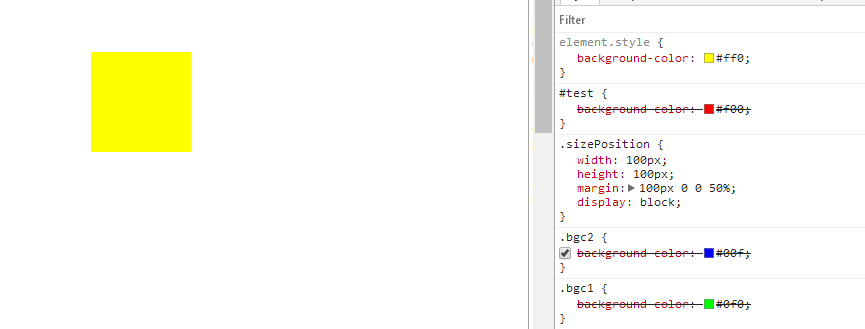
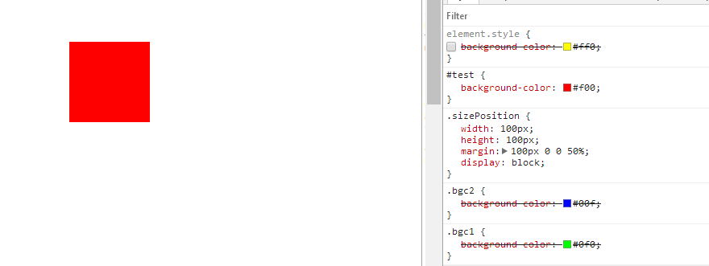
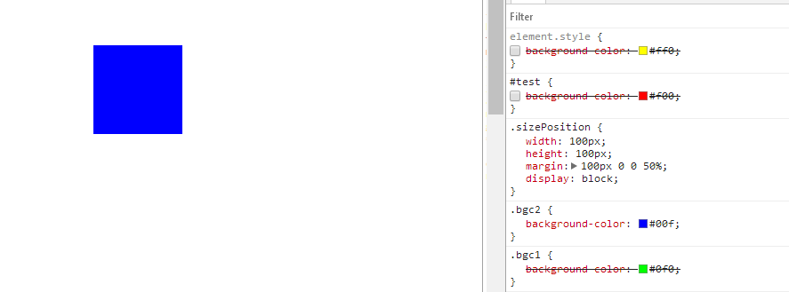
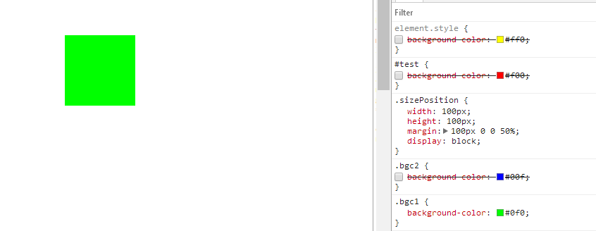
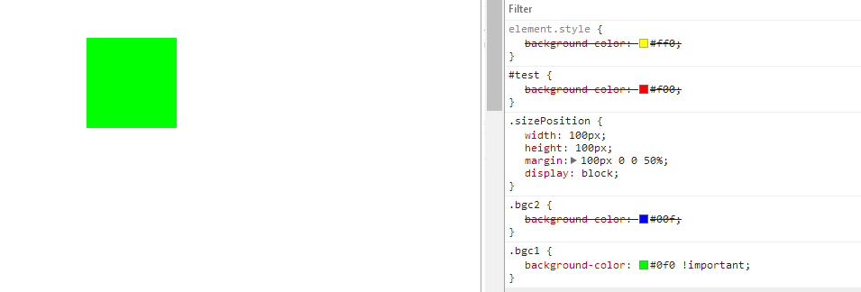
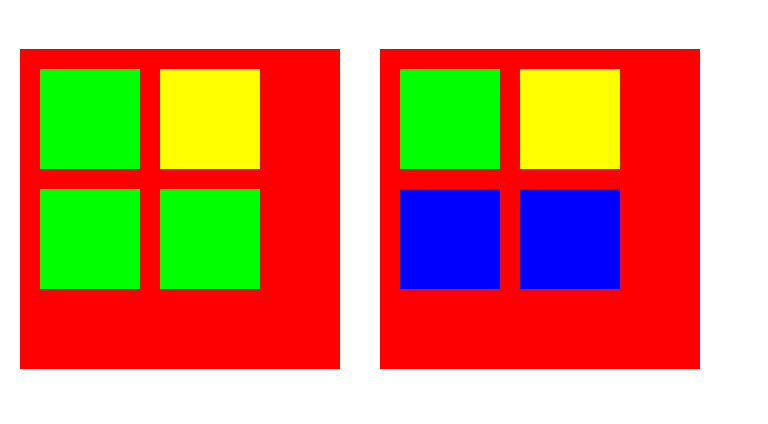
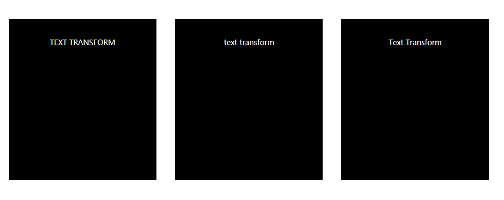
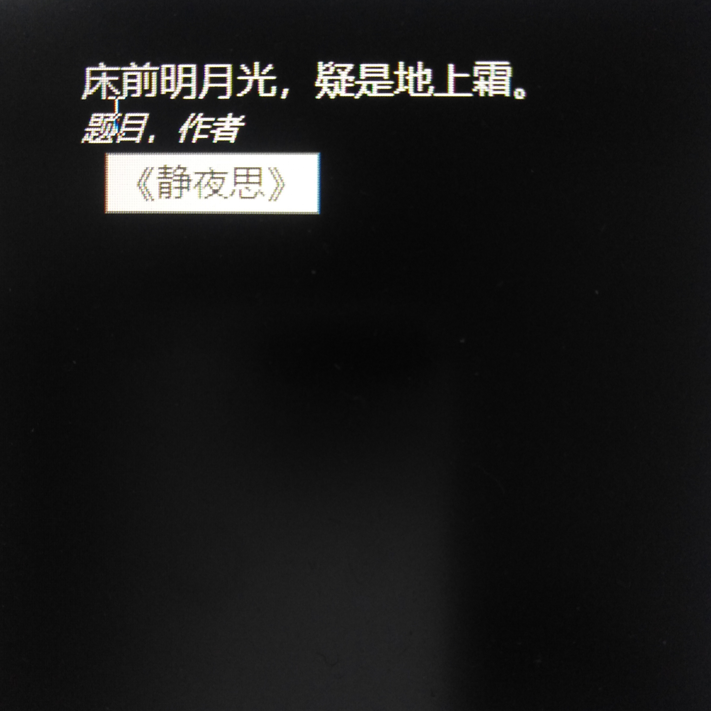
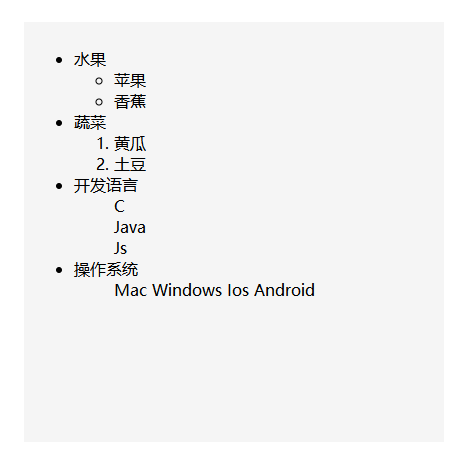

# CSS
+ ie8不支持border-radius解决
  + [下载](http://css3pie.com/download/)PIE.htc文件
  + css
  ```css
    border-radius:50%;
    behavior:url(pieRootPath/PIE.htc);
    /*由于实现方式的原因，需要添加position: relative，一般也需要z-index*/
    position: relative;
    z-index:10;
  ```
  + PIE.htc position:使得IE(6、7、8)浏览器支持CSS3的border-radius、box-shadow、gradient、RGBA等属性
  + A>B
  ```
  css3特有的选择器，A>B 表示选择A元素的所有子B元素。
  与A B的区别在于，A B选择所有后代元素，而A>B只选择第一代。
  ```
+ css 渲染优先级
  ```html
  <DOCTYPE html>
  <html lang="en">
  <head>
    <meta charset="utf-8">
    <meta http-equiv=“X-UA-Compatible" content=“IE=edge" charset="utf-8">
    <meta name=“viewport" content=“width=device-width, initial-scale=1">
  </head>
  <style type="text/css">
    #test{background-color:#f00;}
    .bgc1{background-color:#0f0;}
    .bgc2{background-color:#00f;}
    .sizePosition
    {
      width:100px;
      height:100px;
      margin:100px 0 0 50%;
      display:block;
    }
  </style>
  <body>
    <div id="test" class="bgc1 bgc2 sizePosition" style="background-color:#ff0;"></div>
  </body>
  </html>
  ```
  + 结果
  ---
  
   ---
  
   ---
  
   ---
  
  ---
  
  ---
  + 总结
  ```
  1.style下的样式优先级>id选择器下的样式优先级>class选择器下的样式优先级
  2.同一优先级选择后面的样式渲染
  3.如果样式后面有!important则选择该样式
  ```
+ 选择器
  + [css 属性选择器](http://www.w3school.com.cn/css/css_selector_attribute.asp)
  ---
  |选择器|描述|
  |:---:|:---:|
  |[attribute]|用于选取带有指定属性的元素。|
  |[attribute=value]|用于选取带有指定属性和值的元素。|
  |[attribute~=value]|用于选取属性值中包含指定词汇的元素。|
  |[attribute\|=value]|用于选取带有以指定值开头的属性值的元素，该值必须是整个单词。|
  |[attribute^=value]|匹配属性值以指定值开头的每个元素。|
  |[attribute$=value]|匹配属性值以指定值结尾的每个元素。|
  |[attribute*=value]|匹配属性值中包含指定值的每个元素。|
  + 子选择器&兄弟选择器
  ```html
  <style type="text/css">
		.parent{background-color:#f00;}
		.parent>div{background-color:#0f0;}
		.sizePosition
		{
			width:300px;
			height:300px;
			margin:100px 10px 0 30px;
			padding:10px;
			float:left;
			display:block;
		}
		.sizePosition>div /* 子选择器 */
		{
			width:100px;
			height:100px;
			margin:10px;
			text-align:center;
			float:left;
			display:block;
		}
		.fistChild+div{background-color:#ff0;} /* 相邻兄弟选择器 */
		#secondChild~div{background-color:#00f;} /* 所有兄弟选择器 */
	</style>
	<body>
		<div class="parent sizePosition">
			<div class="firstChild"></div>
			<div></div>
			<div></div>
			<div></div>
		</div>
		<div class="parent sizePosition">
			<div class="firstChild"></div>
			<div id="secondChild"></div>
			<div></div>
			<div></div>
		</div>
	</body>
  ```
  + 结果
  ---
  
  + 大小写
  ```html
  <style>
	.upper{text-transform:uppercase;}
	.lower{text-transform:lowercase;}
	.capit{text-transform:capitalize;}
	.sizePosition
		{
			width:300px;
			height:300px;
			margin:100px 10px 0 30px;
			padding:10px;
			float:left;
			display:block;
			background-color:#000;
			color:#fff;
			text-align:center;
		}
	</style>
	<div class="sizePosition upper">text transform</div>
	<div class="sizePosition lower">text transform</div>
	<div class="sizePosition capit">text transform</div>
  ```
  + 结果
  ---
  
  + cite
  ```html
  	<style type="text/css">
		.sizePosition
		{
			width:300px;
			height:300px;
			margin:100px 10px 0 30px;
			padding:10px;
			float:left;
			display:block;
			background-color:#000;
			color:#fff;
		}
	</style>
	<body>
		<div class="sizePosition">
			<blockquote>床前明月光，疑是地上霜。
				<br/>
            	<small><cite title="《静夜思》">题目</cite>，<cite title="李白">作者</cite></small>
			</blockquote>
		</div>
	</body>
   ```
   + 结果
   ---
  
  + 列表
  ```html
  	<style type="text/css">
		.sizePosition
		{
			width:400px;
			height:400px;
			margin:100px 10px 0 30px;
			padding:10px;
			float:left;
			display:block;
			background-color:#f5f5f5;
			color:#000;
		}
		.list-inline {list-style: none;}
		.list-inline > li {display: inline-block;}
	</style>
	<div class="sizePosition">
		<ul>
			<li>水果</li><!-- 无序 -->
			<ul title="fruit">
				<li>苹果</li>
				<li>香蕉</li>
			</ul>
			<li>蔬菜</li><!-- 有序 -->
			<ol title="vegetable">
				<li>黄瓜</li>
				<li>土豆</li>
			</ol>
			<li>开发语言</li><!-- 去除列表项前的符号 -->
			<ul title="develop language" style="list-style:none;">
				<li>C</li>
				<li>Java</li>
				<li>Js</li>
			</ul>
			<li>操作系统</li><!-- 水平显示 -->
			<ul title="os" class="list-inline">
				<li>Mac</li>
				<li>Windows</li>
				<li>Ios</li>
				<li>Android</li>
			</ul>
		</ul>
	</div>
  ```
  + 结果
  ---
  
