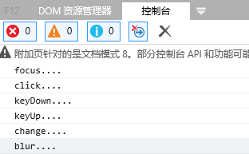

# input输入框的事件的执行顺序
1. input输入框
```html
<input type="text" 
  onfocus="funFocus()" 
  onblur="funBlur()" 
  onclick="funClick()" 
  onchange="funChange()" 
  onkeydown="funKeyDown()" 
  onkeyup="funKeyUp()"
>
```
2.js 事件function
```js
function funFocus() {
    console.log("focus....")
}

function funBlur() {
    console.log("blur....")
}

function funClick() {
    console.log("click....")
}

function funChange() {
    console.log("change....")
}

function funKeyDown() {
    console.log("keyDown....")
}

function funKeyUp() {
    console.log("keyUp....")
}
```
3.结果(从input输入数值'1'到其失去焦点的过程)
---

---

