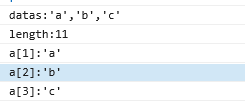

# Jquery(Javascript)
0.JS执行机制
+ 单线程
+ 异步执行(Event Loop)
   + 同步任务(先)
   + 异步任务(后)
     + 微任务(先)(例如：Promise，process.nextTick)
     + 宏任务(后)(例如：setTimeout，setInterva)
1. 非法字符(Illegal character)与网址链接相互转换的JS方法
	+ encodeURI("非法字符")
	+ decodeURI("网址链接")
	+ 例子
		+ encodeURI("哈喽")=%E5%93%88%E5%96%BD
		+ encodeURI("%E5%93%88%E5%96%BD")=哈喽
2. Jquery添加与移除html元素
	+ $("#elementId").append("html content")
	+ $("#elementId").html("")
	+ 例子
		+ $("#selecId").append("<option value=\" + value + "\">value</option>")
		+ $("#selecId").html("")	
3. 获取选定的option的值
```jquery
var optionSelected = $("#selectedId option:selected")
var value = optionSelected.val()
var text  = optionSelected.text()
```
4. 自定义trim函数(去除字符串首尾空格)[正则符号](https://github.com/Tanglong9344/ref/tree/master/regExp/SymbolTable/README.md)
```js
function trim(str){
	return str.replace(/(^\s*)|(\s*$)/g,"");// g(global)表示全局匹配
}
```
5. 页面随窗口大小变化
+ 重新加载页面的实现方式
```
1. history.go(0)
2. window.location.reload()
3. document.execCommand("Refresh")
4. document.URL=window.location
5. window.location=window.location
6. window.location.assign(window.location)
7. window.navigate(window.location)
```
+ 实现代码
```js
$(window).resize(function() {
    setTimeout(window.location.reload(),1000);//延时1s执行
});
```
6. [undefined](http://www.w3school.com.cn/jsref/jsref_undefined.asp)
```js
// 只能用 === 运算来测试某个值是否是未定义的，因为 == 运算符认为 undefined 值等价于 null。
// null 表示无值，而 undefined 表示一个未声明的变量，或已声明但没有赋值的变量，或一个并不存在的对象属性。
if(userName === undefined){alert("Hello undefined!")}
```
7. 小数
```js
var f1 = 3.1415926;
f1 = f1.toFixed(2) // 结果3.14

var f2 = 3.1415926;
f2 = Math.floor(f2* 100) / 100 // 结果3.14

var f3 = 3.1415926;
f3 = Number(f3.toString().match(/^\d+(?:\.\d{0,2})?/)) // 结果3.14

var f4 = 3.1415926;
f4 = Math.round(f4) // 四舍五入， 结果3

var f5 = 3.1415926;
f5 = Math.ceil(f5) // 向上取整， 结果4

var f6 = 3.1415926;
f6 = Math.floor(f6) // 向下取整， 结果3
```
8.编码
```js
var name="唐龙&+abc123,;";

var name1 = encodeURI(name)
console.log("name1:" + name1)
console.log("name12:" + decodeURI(name1))

// 编码的字符范围更大
var name2 = encodeURIComponent(name)
console.log("name2:" + name2)
console.log("name22:" + decodeURIComponent(name2))

// 输出结果：
// name1:%E5%94%90%E9%BE%99&+abc123,;
// name12:唐龙&+abc123,;
// name2:%E5%94%90%E9%BE%99%26%2Babc123%2C%3B
// name22:唐龙&+abc123,;
```
9. [trigger()](http://www.w3school.com.cn/jquery/event_trigger.asp)
```js
// trigger()用于出发元素的特定事件(select、change、click...)
$("#elementId").trigger("change")
```
10.[jQuery :eq() 选择器](http://www.w3school.com.cn/jquery/selector_eq.asp)
```js
$("p:eq(0)") // 0表示第一个p元素
```
11.父节点、子节点、兄弟节点
```js
var elemenetId = $("#elementId")
// 父节点
elemenetId.parent()
elemenetId.parent("#parentId")
// 子节点
elemenetId.children()
elemenetId.children("#childId")
// 兄弟节点
elemenetId.prev()//上一个
elemenetId.next()//下一个
elemenetId.siblings()//所有

elemenetId.prev("#sibId")//上一个
elemenetId.next("#sibId")//下一个
elemenetId.siblings("#sibId")//所有
```
12.元素上移与下移
```html
<p>P111<button onclick="moveOn(this)">上移</button><button onclick="moveDown(this)">下移</button></p>
<p>P222<button onclick="moveOn(this)">上移</button><button onclick="moveDown(this)">下移</button></p>
<p>P333<button onclick="moveOn(this)">上移</button><button onclick="moveDown(this)">下移</button></p>
```
```js
/** 上移 */
function moveOn(obj){
	var parent = $(obj).parent("p")
	var prevObj = parent.prev("p");
	if(prevObj){prevObj.before(parent)}
}

/** 下移 */
function moveDown(obj){
	var parent = $(obj).parent("p")
	var nextObj = parent.next("p");
	if(nextObj){nextObj.after(parent)}
}
```
13.JSON & js Object
```js
1.JSON.parse() 方法:将JSON字符串解析为JSON对象
2.$.parseJSON():将格式完好(符合严格的JSON格式)的JSON字符串转为与之对应的JavaScript对象
3.JSON.stringify():将JSON对象解析为JSON字符串
```
14.Jquery插件
+ [树插件zTree](http://www.treejs.cn/v3/api.php)
---
15.[$(function(){})](http://www.w3school.com.cn/jquery/event_ready.asp)
```js
$(function() {})是的$(document).ready(function(){})简写，也可以写成$().ready(function(){})
```
16.c标签与js函数
```js
$(function () {
	<c:set var="datas" value="'a','b','c'"/>
	console.log("datas:${datas}")
	console.log("length:${datas.length()}")
	<c:forEach items="${datas}" var="data" varStatus="i">
		console.log("a[${i.count}]:${data}")
	</c:forEach>
})
```
---
输出结果
---

