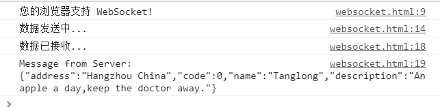
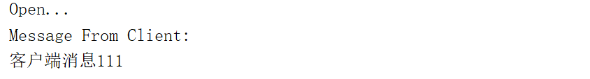

# Html5 WebSocket
+ 测试条件
  + Goole浏览器(71.0.3578.98)
  + JDK 1.8.0
  + Tomcat8.5.34
  + 需要导入tomcat lib目录下的websocket-api.jar
+ [html页面](htmlWebSocket.html)
+ [java代码](JavaWebSocket.java)
# 结果
---

---

